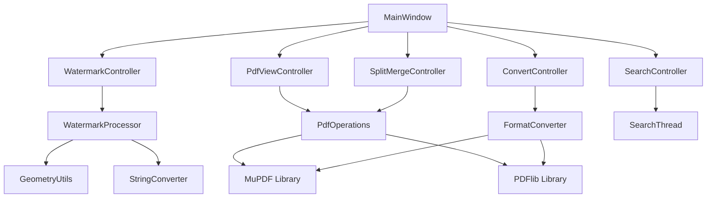

# PDF Widgets 开发者指南

## 目录
1. [开发环境配置](#开发环境配置)
2. [项目架构详解](#项目架构详解)
3. [核心设计模式](#核心设计模式)
4. [模块开发指南](#模块开发指南)
5. [多线程编程规范](#多线程编程规范)
6. [UI开发规范](#ui开发规范)
7. [代码风格指南](#代码风格指南)
8. [调试和测试](#调试和测试)
9. [性能优化建议](#性能优化建议)
10. [扩展开发指南](#扩展开发指南)

---

## 开发环境配置

### 必需工具

#### Qt开发环境
```bash
# 推荐Qt版本
Qt 5.12.12 LTS 或更高版本

# 必需组件
- Qt Creator 4.11+
- Qt Designer
- qmake 构建工具
- Qt帮助文档
```

#### 编译器支持
```bash
# Windows
- MSVC 2017/2019/2022
- MinGW 7.3+ (64位)

# 编译器设置
- C++11 标准支持
- UTF-8 编码支持
- 线程库支持
```

#### 第三方库配置

**MuPDF配置**：
```pro
# 在.pro文件中添加
LIBS += -L$$PWD/lib/mupdf -lmupdf -lthirdparty -lmuthreads
INCLUDEPATH += $$PWD/lib/mupdf/include
```

**PDFlib配置**：
```pro
# PDFlib商业库配置
LIBS += -L$$PWD/lib/pdflib -lpdflib
INCLUDEPATH += $$PWD/lib/pdflib/include
```

**libxml2配置**：
```pro
# XML处理库
LIBS += -L$$PWD/lib/libxml2 -lxml2
INCLUDEPATH += $$PWD/lib/libxml2/include
```

### 项目构建

#### 基本构建流程
```bash
# 1. 克隆项目
git clone <repository-url>
cd pdfwidgets

# 2. 生成Makefile
qmake pdfwidgets.pro

# 3. 编译项目
make release    # 发布版本
make debug      # 调试版本

# 4. 运行程序
./pdfviewer/release/pdfviewer.exe
```

#### 构建选项详解
```bash
# 静态链接Qt（发布用）
qmake CONFIG+=static

# 启用详细编译信息
qmake CONFIG+=verbose

# 禁用警告（不推荐）
qmake CONFIG+=no_warnings

# 自定义安装路径
qmake PREFIX=/usr/local
```

---

## 项目架构详解

### 整体架构

```
┌─────────────────┐
│   Presentation  │  ← UI层：Qt Widgets界面
├─────────────────┤
│   Controller    │  ← 控制层：MVC控制器
├─────────────────┤
│   Business      │  ← 业务层：功能模块
├─────────────────┤
│   Data Access   │  ← 数据层：文件操作
└─────────────────┘
```

### 核心组件关系图



### 目录结构详解

```
pdfwidgets/
├── pdfviewer/                  # 主应用程序目录
│   ├── main.cpp               # 程序入口点
│   ├── mainwindow.h/cpp       # 主窗口类（1530行）
│   ├── mainwindow.ui          # UI设计文件
│   ├── function.h             # 功能聚合头文件
│   │
│   ├── include/               # 头文件目录
│   │   ├── function/          # 核心功能模块
│   │   │   ├── FileDetector.h
│   │   │   ├── PdfOperations.h
│   │   │   ├── WatermarkProcessor.h
│   │   │   ├── FormatConverter.h
│   │   │   ├── GeometryUtils.h
│   │   │   ├── StringConverter.h
│   │   │   └── FileSystemUtils.h
│   │   │
│   │   ├── controllers/       # MVC控制器层
│   │   ├── mark/             # 水印相关组件
│   │   ├── pdf2image/        # PDF转图片组件
│   │   ├── search/           # 搜索功能组件
│   │   ├── lineedit/         # 自定义输入框
│   │   ├── slider/           # 自定义滑块
│   │   └── textedit/         # 自定义文本编辑器
│   │
│   ├── src/                  # 源码实现目录
│   │   ├── function/         # 功能模块实现
│   │   ├── controllers/      # 控制器实现
│   │   └── [其他组件实现]
│   │
│   ├── lib/                  # 第三方库
│   │   ├── pdflib.h/cpp     # PDFlib封装
│   │   ├── mupdf/           # MuPDF库文件
│   │   ├── libxml2/         # XML处理库
│   │   ├── iconv/           # 编码转换库
│   │   └── qtxlsx/          # Excel处理库
│   │
│   ├── qss/                 # 样式表文件
│   │   └── pdf.css          # 主样式文件
│   │
│   ├── images/              # 图标资源
│   ├── languages/           # 国际化文件
│   ├── resources.qrc        # Qt资源文件
│   └── pdfviewer.pro        # 项目配置文件
│
└── doc/                     # 项目文档
    ├── API-Reference.md     # API参考文档
    ├── Developer-Guide.md   # 开发者指南
    └── [示例PDF文件]
```

---

## 核心设计模式

### 1. MVC模式

**Model（模型层）**：
```cpp
// 例：水印数据模型
struct WatermarkModel {
    QString text;        // 水印文本
    QString fontName;    // 字体名称
    int fontSize;        // 字体大小
    QString color;       // 颜色值
    qreal angle;         // 旋转角度
    qreal opacity;       // 透明度
};
```

**View（视图层）**：
```cpp
// mainwindow.ui定义的界面
// 各种QPushButton、QLineEdit、QSlider等控件
```

**Controller（控制器层）**：
```cpp
class WatermarkController : public QObject {
    Q_OBJECT
public:
    void setModel(const WatermarkModel& model);
    void updateView();
    void processWatermark();
    
private slots:
    void onColorChanged();
    void onTextChanged();
    void onProcessClicked();
};
```

### 2. 单例模式

**线程池管理器**：
```cpp
class ThreadPoolManager {
private:
    static ThreadPoolManager* instance;
    QThreadPool* pool;
    
    ThreadPoolManager() {
        pool = QThreadPool::globalInstance();
        pool->setMaxThreadCount(4); // 设置最大线程数
    }
    
public:
    static ThreadPoolManager* getInstance();
    void submitTask(QRunnable* task);
};
```

### 3. 工厂模式

**线程工厂**：
```cpp
class ThreadFactory {
public:
    static QRunnable* createWatermarkThread(const WatermarkModel& model);
    static QRunnable* createConvertThread(const ConvertModel& model);
    static QRunnable* createSearchThread(const SearchModel& model);
};
```

### 4. 观察者模式

**进度通知**：
```cpp
class ProgressNotifier : public QObject {
    Q_OBJECT
signals:
    void progressChanged(int percentage);
    void taskCompleted(const QString& result);
    void errorOccurred(const QString& error);
};
```

---

## 模块开发指南

### 创建新功能模块

#### 1. 定义头文件

在`include/function/`目录创建新模块头文件：

```cpp
// include/function/NewFeature.h
#pragma once
#ifndef NEW_FEATURE_H
#define NEW_FEATURE_H

#include <QString>
#include <QStringList>

/**
 * @brief 新功能模块
 * @details 详细描述模块功能和用途
 */
namespace NewFeature {
    /**
     * @brief 主要功能函数
     * @param input 输入参数描述
     * @param output 输出参数描述
     * @return 返回值描述
     */
    int processFunction(const QString& input, QString& output);
    
    /**
     * @brief 辅助功能函数
     * @param files 文件列表
     * @return 处理结果列表
     */
    QStringList helperFunction(const QStringList& files);
}

#endif // NEW_FEATURE_H
```

#### 2. 实现源文件

在`src/function/`目录创建实现文件：

```cpp
// src/function/NewFeature.cpp
#include "include/function/NewFeature.h"
#include <QDebug>
#include <QFileInfo>

namespace NewFeature {

int processFunction(const QString& input, QString& output) {
    // 参数验证
    if (input.isEmpty()) {
        qDebug() << "输入参数为空";
        return -1;
    }
    
    // 功能实现
    try {
        // TODO: 实现具体功能
        output = "处理结果：" + input;
        return 0; // 成功
    }
    catch (const std::exception& e) {
        qDebug() << "处理异常：" << e.what();
        return -2; // 处理失败
    }
}

QStringList helperFunction(const QStringList& files) {
    QStringList results;
    
    for (const QString& file : files) {
        QFileInfo info(file);
        if (info.exists() && info.isFile()) {
            results.append(file);
        }
    }
    
    return results;
}

} // namespace NewFeature
```

#### 3. 注册到聚合头文件

在`function.h`中添加新模块：

```cpp
// function.h
#include "include/function/NewFeature.h"

// 提供全局函数别名（可选）
inline int newFeatureProcess(const QString& input, QString& output) {
    return NewFeature::processFunction(input, output);
}
```

#### 4. 创建对应的线程类

```cpp
// include/newfeature/NewFeatureThread.h
class NewFeatureThread : public QObject, public QRunnable {
    Q_OBJECT
    
public:
    NewFeatureThread();
    ~NewFeatureThread();
    
    void setInputData(const QString& input);
    void run() override;
    
signals:
    void processFinished(const QString& result);
    void errorOccurred(const QString& error);
    
private:
    QString m_input;
    QMutex m_mutex; // 线程安全
};
```

### 模块集成规范

#### 1. 在MainWindow中集成

```cpp
// mainwindow.h
private slots:
    void onNewFeatureClicked();
    void onNewFeatureFinished(const QString& result);

private:
    NewFeatureThread* m_newFeatureThread;
```

```cpp
// mainwindow.cpp
void MainWindow::onNewFeatureClicked() {
    // 获取UI输入
    QString input = ui->lineEditInput->text();
    
    // 创建线程任务
    m_newFeatureThread = new NewFeatureThread();
    m_newFeatureThread->setInputData(input);
    
    // 连接信号
    connect(m_newFeatureThread, &NewFeatureThread::processFinished,
            this, &MainWindow::onNewFeatureFinished);
    
    // 提交到线程池
    QThreadPool::globalInstance()->start(m_newFeatureThread);
}

void MainWindow::onNewFeatureFinished(const QString& result) {
    // 更新UI显示结果
    ui->textEditLog->append("新功能处理完成：" + result);
}
```

---

## 多线程编程规范

### 线程类设计规范

#### 1. 基础线程类模板

```cpp
class BaseThread : public QObject, public QRunnable {
    Q_OBJECT
    
public:
    BaseThread() {
        setAutoDelete(true); // 自动删除
    }
    
    virtual ~BaseThread() = default;
    
    // 纯虚函数，子类必须实现
    virtual void run() override = 0;
    
protected:
    QMutex m_mutex;          // 互斥锁
    volatile bool m_stopped; // 停止标志
    
signals:
    void finished();
    void error(const QString& message);
    void progressChanged(int percentage);
};
```

#### 2. 具体线程类实现

```cpp
class ConcreteThread : public BaseThread {
    Q_OBJECT
    
public:
    ConcreteThread() : BaseThread(), m_progress(0) {}
    
    void setParameters(const QString& param1, int param2) {
        QMutexLocker locker(&m_mutex);
        m_param1 = param1;
        m_param2 = param2;
    }
    
    void run() override {
        try {
            // 检查停止标志
            if (m_stopped) return;
            
            // 执行任务逻辑
            for (int i = 0; i < 100 && !m_stopped; ++i) {
                // 模拟工作
                QThread::msleep(10);
                
                // 更新进度
                m_progress = i;
                emit progressChanged(i);
            }
            
            emit finished();
        }
        catch (const std::exception& e) {
            emit error(QString("执行错误：%1").arg(e.what()));
        }
    }
    
    void stop() {
        QMutexLocker locker(&m_mutex);
        m_stopped = true;
    }
    
private:
    QString m_param1;
    int m_param2;
    int m_progress;
};
```

### 线程安全最佳实践

#### 1. 使用互斥锁保护共享数据

```cpp
class ThreadSafeData {
private:
    mutable QMutex m_mutex;
    QStringList m_data;
    
public:
    void addData(const QString& item) {
        QMutexLocker locker(&m_mutex);
        m_data.append(item);
    }
    
    QStringList getData() const {
        QMutexLocker locker(&m_mutex);
        return m_data; // 返回副本
    }
    
    int size() const {
        QMutexLocker locker(&m_mutex);
        return m_data.size();
    }
};
```

#### 2. 使用信号槽进行线程间通信

```cpp
// 在主线程中
connect(thread, &WorkerThread::dataReady,
        this, &MainWindow::onDataReceived,
        Qt::QueuedConnection); // 队列连接确保线程安全
```

#### 3. 避免在非主线程中操作UI

```cpp
// 错误的做法（在工作线程中直接操作UI）
void WorkerThread::run() {
    ui->label->setText("处理中..."); // 危险！
}

// 正确的做法（通过信号通知主线程）
void WorkerThread::run() {
    emit statusChanged("处理中...");
}

// 在主线程中
void MainWindow::onStatusChanged(const QString& status) {
    ui->label->setText(status); // 安全
}
```

---

## UI开发规范

### Qt Designer使用规范

#### 1. 控件命名规范

```cpp
// 按钮命名
QPushButton *btnOpen;        // btn + 功能描述
QPushButton *btnSave;
QPushButton *btnProcess;

// 输入框命名
QLineEdit *lineEditInput;    // lineEdit + 用途
QLineEdit *lineEditOutput;
QLineEdit *lineEditFilename;

// 标签命名
QLabel *labTitle;           // lab + 描述
QLabel *labStatus;
QLabel *labProgress;

// 组合框命名
QComboBox *cBoxFont;        // cBox + 选项类型
QComboBox *cBoxResolution;
```

#### 2. 布局设计规范

```cpp
// 推荐的布局层次
QMainWindow
└── QWidget (centralWidget)
    └── QGridLayout (gridLayout)
        ├── QTabWidget (tabWidget)
        │   ├── QWidget (水印操作页面)
        │   ├── QWidget (转换工具页面)
        │   ├── QWidget (文件拆分页面)
        │   ├── QWidget (文件合并页面)
        │   └── QWidget (设备搜索页面)
        └── QTextEdit (textEditLog)
```

#### 3. 样式表规范

```css
/* qss/pdf.css */

/* 全局样式 */
QMainWindow {
    background: qlineargradient(x1:0, y1:0, x2:0, y2:1, 
                stop:0 #f0f6ff, stop:1 #e8f2ff);
}

/* 按钮样式 */
QPushButton {
    background-color: #ffffff;
    border: 1px solid #b8d4f0;
    border-radius: 4px;
    padding: 4px 8px;
    font: 10pt "Microsoft YaHei UI";
}

QPushButton:hover {
    background-color: #e8f2ff;
    border: 1px solid #5099d3;
}

QPushButton:pressed {
    background-color: #d0e8ff;
}

/* 输入框样式 */
QLineEdit {
    border: 1px solid #b8d4f0;
    border-radius: 3px;
    padding: 2px 4px;
    background-color: #ffffff;
    color: rgb(103, 103, 103);
}

QLineEdit:focus {
    border: 2px solid #5099d3;
    color: rgb(0, 0, 0);
}
```

### 自定义控件开发

#### 1. 自定义输入框

```cpp
// include/lineedit/CustomLineEdit.h
class CustomLineEdit : public QLineEdit {
    Q_OBJECT
    
public:
    explicit CustomLineEdit(QWidget *parent = nullptr);
    
protected:
    void dragEnterEvent(QDragEnterEvent *event) override;
    void dropEvent(QDropEvent *event) override;
    void paintEvent(QPaintEvent *event) override;
    
signals:
    void fileDropped(const QString& filePath);
    
private:
    void setupUI();
    bool m_allowDrop;
};
```

```cpp
// src/lineedit/CustomLineEdit.cpp
CustomLineEdit::CustomLineEdit(QWidget *parent)
    : QLineEdit(parent), m_allowDrop(true) {
    setupUI();
    setAcceptDrops(true);
}

void CustomLineEdit::dragEnterEvent(QDragEnterEvent *event) {
    if (event->mimeData()->hasUrls() && m_allowDrop) {
        event->acceptProposedAction();
        setStyleSheet("border: 2px dashed #5099d3;");
    } else {
        event->ignore();
    }
}

void CustomLineEdit::dropEvent(QDropEvent *event) {
    const QMimeData *mimeData = event->mimeData();
    
    if (mimeData->hasUrls()) {
        QList<QUrl> urlList = mimeData->urls();
        if (!urlList.isEmpty()) {
            QString filePath = urlList.first().toLocalFile();
            setText(filePath);
            emit fileDropped(filePath);
        }
    }
    
    setStyleSheet(""); // 恢复默认样式
    event->acceptProposedAction();
}
```

#### 2. 自定义滑块

```cpp
// include/slider/CustomSlider.h
class CustomSlider : public QSlider {
    Q_OBJECT
    
public:
    explicit CustomSlider(QWidget *parent = nullptr);
    
protected:
    void paintEvent(QPaintEvent *event) override;
    void mousePressEvent(QMouseEvent *event) override;
    
private:
    void drawSlider(QPainter &painter);
    QColor m_trackColor;
    QColor m_handleColor;
};
```

### 国际化支持

#### 1. 翻译文件创建

```bash
# 生成翻译文件
lupdate pdfviewer.pro

# 编译翻译文件
lrelease languages/zh_CN.ts
```

#### 2. 代码中使用翻译

```cpp
// 在代码中使用tr()函数
QString message = tr("文件处理完成");
QString title = tr("PDF工具集");

// 在UI中设置可翻译文本
ui->btnOpen->setText(tr("打开文件"));
ui->labStatus->setText(tr("就绪"));
```

---

## 代码风格指南

### 命名规范

#### 1. 类名规范

```cpp
// 使用PascalCase，描述性命名
class PdfProcessor;
class WatermarkGenerator;
class FileSystemHelper;
class ThreadPoolManager;
```

#### 2. 函数名规范

```cpp
// 使用camelCase，动词+名词
void processDocument();
void addWatermark();
void splitPdfFile();
bool isValidFormat();
QString getFileName();
```

#### 3. 变量名规范

```cpp
// 成员变量使用m_前缀
class MyClass {
private:
    QString m_fileName;
    int m_pageCount;
    QMutex m_mutex;
};

// 局部变量使用camelCase
void function() {
    QString inputFile;
    int totalPages;
    bool isSuccess;
}

// 常量使用全大写+下划线
const int MAX_THREAD_COUNT = 8;
const QString DEFAULT_FONT_NAME = "新宋体";
```

### 注释规范

#### 1. 文件头注释

```cpp
/**
 * @file PdfProcessor.cpp
 * @brief PDF处理核心功能实现
 * @details 本文件实现了PDF文档的分析、编辑、转换等核心功能
 * 
 * 主要功能包括：
 * - PDF文档信息获取
 * - 页面拆分和合并
 * - 水印添加处理
 * - 格式转换支持
 * 
 * @author PDF工具集开发团队
 * @date 2023-2024
 * @version 1.0
 */
```

#### 2. 类注释

```cpp
/**
 * @class PdfProcessor
 * @brief PDF文档处理器类
 * @details 提供PDF文档的各种处理功能，包括但不限于：
 * 
 * 核心功能：
 * - 文档信息提取：页数、尺寸、元数据
 * - 文档拆分：按页数或范围拆分
 * - 文档合并：多文件合并为单个PDF
 * - 水印处理：添加文本或图片水印
 * 
 * 使用示例：
 * @code
 * PdfProcessor processor;
 * processor.loadDocument("input.pdf");
 * processor.addWatermark("机密", "新宋体", 25);
 * processor.saveDocument("output.pdf");
 * @endcode
 * 
 * @note 所有操作都在独立线程中执行，确保UI响应性
 * @warning 需要确保PDF文件有读写权限
 */
class PdfProcessor {
    // ...
};
```

#### 3. 函数注释

```cpp
/**
 * @brief 为PDF文档添加多行文本水印
 * @details 支持在PDF的每一页添加自定义样式的多行文本水印
 * 
 * 功能特性：
 * - 支持多行文本（使用\n分隔）
 * - 可自定义字体、大小、颜色
 * - 支持旋转角度和透明度设置
 * - 自动居中定位
 * 
 * @param inputFile 输入PDF文件路径
 * @param outputFile 输出PDF文件路径
 * @param watermarkText 水印文本内容（支持\n换行）
 * @param fontName 字体名称（新宋体、楷体、仿宋、黑体）
 * @param fontSize 字体大小（推荐8-50）
 * @param color 文本颜色（#RRGGBB格式）
 * @param angle 旋转角度（0-180度）
 * @param opacity 透明度（0-100%）
 * 
 * @return int 操作结果
 * @retval 0 成功添加水印
 * @retval -1 输入文件不存在或无法读取
 * @retval -2 输出路径无法写入
 * @retval -3 PDF文档格式错误
 * @retval -4 字体不支持或参数无效
 * 
 * @note 处理大文件时可能需要较长时间，建议在独立线程中调用
 * @warning 确保有足够磁盘空间存储输出文件
 * 
 * @see GeometryUtils::createSVG() 
 * @see StringConverter::QString2WString()
 * 
 * @since 版本1.0
 * @author 张三
 * @date 2023-12-01
 */
int addWatermark_multiline(
    const std::string& inputFile,
    const std::string& outputFile,
    const QString& watermarkText,
    const QString& fontName,
    int fontSize,
    const QString& color,
    qreal angle,
    qreal opacity
);
```

### 代码格式规范

#### 1. 缩进和空格

```cpp
// 使用4个空格缩进，不使用Tab
class MyClass {
public:
    MyClass();
    ~MyClass();
    
    void publicFunction();
    
private:
    void privateFunction();
    
    QString m_memberVariable;
};

// 函数实现
void MyClass::publicFunction() {
    if (condition) {
        // 4空格缩进
        doSomething();
    } else {
        // 4空格缩进
        doOtherThing();
    }
}
```

#### 2. 括号和空行

```cpp
// 函数和类的大括号独占一行
class MyClass 
{
public:
    void function()
    {
        // 函数体
    }
};

// 控制语句的大括号紧跟条件
if (condition) {
    // 语句块
} else if (otherCondition) {
    // 其他语句块
} else {
    // 默认语句块
}

// 函数之间保持一个空行
void function1() {
    // 实现
}

void function2() {
    // 实现
}
```

---

## 调试和测试

### 调试配置

#### 1. Qt Creator调试配置

```json
// .vscode/launch.json (如果使用VSCode)
{
    "version": "0.2.0",
    "configurations": [
        {
            "name": "Debug PDF Widgets",
            "type": "cppvsdbg",
            "request": "launch",
            "program": "${workspaceFolder}/pdfviewer/debug/pdfviewer.exe",
            "args": [],
            "stopAtEntry": false,
            "cwd": "${workspaceFolder}",
            "environment": [],
            "console": "integratedTerminal"
        }
    ]
}
```

#### 2. 调试宏定义

```cpp
// debug.h
#ifndef DEBUG_H
#define DEBUG_H

#include <QDebug>
#include <QTime>

#ifdef QT_DEBUG
    #define DEBUG_FUNC() qDebug() << "[DEBUG]" << __FUNCTION__ << "line:" << __LINE__
    #define DEBUG_VAR(var) qDebug() << "[DEBUG]" << #var << "=" << var
    #define DEBUG_TIME(msg) qDebug() << "[TIME]" << msg << QTime::currentTime().toString()
#else
    #define DEBUG_FUNC()
    #define DEBUG_VAR(var)
    #define DEBUG_TIME(msg)
#endif

#endif // DEBUG_H
```

#### 3. 日志系统

```cpp
// logger.h
class Logger {
public:
    enum LogLevel {
        Debug = 0,
        Info = 1,
        Warning = 2,
        Error = 3
    };
    
    static void log(LogLevel level, const QString& message);
    static void setLogFile(const QString& filePath);
    static void setLogLevel(LogLevel level);
    
private:
    static QString m_logFile;
    static LogLevel m_currentLevel;
};

// 使用方式
Logger::log(Logger::Info, "开始处理PDF文件");
Logger::log(Logger::Error, "文件处理失败：" + errorMessage);
```

### 单元测试

#### 1. 测试框架配置

```pro
# test.pro
QT += core testlib
CONFIG += testcase

TARGET = test_pdfwidgets
TEMPLATE = app

SOURCES += \
    test_filedetector.cpp \
    test_pdfoperations.cpp \
    test_watermarkprocessor.cpp \
    main_test.cpp

HEADERS += \
    test_filedetector.h \
    test_pdfoperations.h \
    test_watermarkprocessor.h
```

#### 2. 测试用例示例

```cpp
// test_filedetector.h
#include <QTest>
#include "include/function/FileDetector.h"

class TestFileDetector : public QObject {
    Q_OBJECT
    
private slots:
    void initTestCase();          // 测试开始前初始化
    void cleanupTestCase();       // 测试结束后清理
    void init();                  // 每个测试前初始化
    void cleanup();               // 每个测试后清理
    
    void testPdfExtensionDetection();
    void testImageExtensionDetection();
    void testMagicNumberDetection();
    void testNumericValidation();
};

// test_filedetector.cpp
void TestFileDetector::testPdfExtensionDetection() {
    // 正常情况测试
    QVERIFY(FileDetector::isPDFByExtension("document.pdf"));
    QVERIFY(FileDetector::isPDFByExtension("Document.PDF"));
    QVERIFY(FileDetector::isPDFByExtension("/path/to/file.pdf"));
    
    // 边界情况测试
    QVERIFY(!FileDetector::isPDFByExtension("document.txt"));
    QVERIFY(!FileDetector::isPDFByExtension(""));
    QVERIFY(!FileDetector::isPDFByExtension("pdf"));
}

void TestFileDetector::testNumericValidation() {
    // 有效数字
    QVERIFY(FileDetector::isNumeric("123"));
    QVERIFY(FileDetector::isNumeric("0"));
    QVERIFY(FileDetector::isNumeric("999999"));
    
    // 无效数字
    QVERIFY(!FileDetector::isNumeric("123abc"));
    QVERIFY(!FileDetector::isNumeric(""));
    QVERIFY(!FileDetector::isNumeric("12.34"));
}
```

#### 3. 性能测试

```cpp
// performance_test.cpp
void TestPerformance::benchmarkPdfProcessing() {
    QString testFile = "test_data/large_document.pdf";
    
    QBENCHMARK {
        int pages = PdfOperations::getPages(testFile.toStdString());
        Q_UNUSED(pages)
    }
}

void TestPerformance::benchmarkWatermarkProcessing() {
    WatermarkModel model;
    model.text = "测试水印";
    model.fontName = "新宋体";
    model.fontSize = 25;
    
    QBENCHMARK {
        // 测试水印处理性能
        WatermarkProcessor::addWatermark_multiline(
            "test.pdf", "output.pdf", 
            model.text, model.fontName, model.fontSize,
            "#000000", 45.0, 30.0
        );
    }
}
```

---

## 性能优化建议

### 1. 内存管理优化

#### 智能指针使用

```cpp
// 推荐使用智能指针管理动态内存
#include <memory>

class ResourceManager {
private:
    std::unique_ptr<QByteArray> m_pdfData;
    std::shared_ptr<QPdfDocument> m_document;
    
public:
    void loadPdf(const QString& filePath) {
        // 自动内存管理，无需手动delete
        m_document = std::make_shared<QPdfDocument>();
        m_document->load(filePath);
    }
};
```

#### 大文件处理优化

```cpp
// 流式处理大PDF文件
class StreamProcessor {
public:
    void processLargePdf(const QString& filePath) {
        QFile file(filePath);
        if (!file.open(QIODevice::ReadOnly)) return;
        
        const qint64 bufferSize = 64 * 1024; // 64KB缓冲区
        QByteArray buffer(bufferSize, 0);
        
        while (!file.atEnd()) {
            qint64 bytesRead = file.read(buffer.data(), bufferSize);
            if (bytesRead > 0) {
                processChunk(buffer, bytesRead);
            }
        }
    }
    
private:
    void processChunk(const QByteArray& data, qint64 size) {
        // 处理数据块
    }
};
```

### 2. 并发处理优化

#### 线程池调优

```cpp
// 根据系统配置调整线程池
void optimizeThreadPool() {
    QThreadPool* pool = QThreadPool::globalInstance();
    
    // 基于CPU核心数设置线程数
    int coreCount = QThread::idealThreadCount();
    int maxThreads = qMax(2, coreCount - 1); // 保留一个核心给UI
    pool->setMaxThreadCount(maxThreads);
    
    // 设置线程超时时间
    pool->setExpiryTimeout(30000); // 30秒
    
    qDebug() << "线程池配置：最大线程数" << maxThreads;
}
```

#### 任务分割策略

```cpp
// 大任务分割为小任务并行处理
class BatchProcessor {
public:
    void processBatch(const QStringList& files) {
        const int batchSize = qMax(1, files.size() / QThread::idealThreadCount());
        
        for (int i = 0; i < files.size(); i += batchSize) {
            QStringList batch = files.mid(i, batchSize);
            
            auto* task = new BatchTask(batch);
            connect(task, &BatchTask::finished, this, &BatchProcessor::onBatchFinished);
            
            QThreadPool::globalInstance()->start(task);
        }
    }
    
private slots:
    void onBatchFinished() {
        m_completedBatches++;
        if (m_completedBatches == m_totalBatches) {
            emit allBatchesCompleted();
        }
    }
};
```

### 3. UI响应性优化

#### 进度反馈机制

```cpp
class ProgressiveTask : public QObject, public QRunnable {
    Q_OBJECT
    
public:
    void run() override {
        const int totalSteps = 100;
        
        for (int i = 0; i <= totalSteps; ++i) {
            // 模拟工作
            QThread::msleep(50);
            
            // 更新进度（每5%更新一次UI）
            if (i % 5 == 0) {
                emit progressChanged(i);
                QCoreApplication::processEvents(); // 处理待定事件
            }
            
            // 检查取消请求
            if (m_cancelled) break;
        }
        
        emit finished();
    }
    
signals:
    void progressChanged(int percentage);
    void finished();
    
private:
    volatile bool m_cancelled = false;
};
```

---

## 扩展开发指南

### 插件架构设计

#### 1. 插件接口定义

```cpp
// include/plugin/PluginInterface.h
class PluginInterface {
public:
    virtual ~PluginInterface() = default;
    
    virtual QString name() const = 0;
    virtual QString version() const = 0;
    virtual QString description() const = 0;
    
    virtual bool initialize() = 0;
    virtual void cleanup() = 0;
    
    virtual QWidget* createWidget(QWidget* parent = nullptr) = 0;
    virtual void process(const QVariantMap& parameters) = 0;
};

Q_DECLARE_INTERFACE(PluginInterface, "com.pdfwidgets.PluginInterface/1.0")
```

#### 2. 插件管理器

```cpp
// include/plugin/PluginManager.h
class PluginManager : public QObject {
    Q_OBJECT
    
public:
    static PluginManager* instance();
    
    void loadPlugins(const QString& pluginDir);
    void unloadPlugins();
    
    QList<PluginInterface*> availablePlugins() const;
    PluginInterface* findPlugin(const QString& name) const;
    
signals:
    void pluginLoaded(PluginInterface* plugin);
    void pluginUnloaded(const QString& name);
    
private:
    QList<QPluginLoader*> m_loaders;
    QList<PluginInterface*> m_plugins;
};
```

### 配置系统扩展

#### 1. 配置管理器

```cpp
// include/config/ConfigManager.h
class ConfigManager : public QObject {
    Q_OBJECT
    
public:
    static ConfigManager* instance();
    
    void loadConfig(const QString& filePath = "");
    void saveConfig();
    
    QVariant getValue(const QString& key, const QVariant& defaultValue = QVariant()) const;
    void setValue(const QString& key, const QVariant& value);
    
    // 预定义配置项
    QString defaultFont() const;
    int defaultFontSize() const;
    QString defaultColor() const;
    int maxThreadCount() const;
    
signals:
    void configChanged(const QString& key, const QVariant& value);
    
private:
    QSettings* m_settings;
    mutable QMutex m_mutex;
};
```

#### 2. 主题系统

```cpp
// include/theme/ThemeManager.h
class ThemeManager : public QObject {
    Q_OBJECT
    
public:
    enum Theme {
        LightTheme,
        DarkTheme,
        CustomTheme
    };
    
    static ThemeManager* instance();
    
    void setTheme(Theme theme);
    void loadCustomTheme(const QString& themeFile);
    
    QString getStyleSheet() const;
    QColor getColor(const QString& colorName) const;
    
signals:
    void themeChanged(Theme newTheme);
    
private:
    Theme m_currentTheme;
    QMap<QString, QColor> m_colors;
    QString m_styleSheet;
};
```

### API扩展指南

#### 1. 添加新的处理引擎

```cpp
// 定义处理引擎接口
class ProcessingEngine {
public:
    virtual ~ProcessingEngine() = default;
    virtual QString name() const = 0;
    virtual bool canProcess(const QString& filePath) const = 0;
    virtual int process(const QString& input, const QString& output, 
                       const QVariantMap& options) = 0;
};

// 实现具体引擎
class CustomPdfEngine : public ProcessingEngine {
public:
    QString name() const override {
        return "CustomPdfEngine";
    }
    
    bool canProcess(const QString& filePath) const override {
        return filePath.endsWith(".pdf", Qt::CaseInsensitive);
    }
    
    int process(const QString& input, const QString& output, 
               const QVariantMap& options) override {
        // 实现自定义处理逻辑
        return 0;
    }
};

// 注册引擎
ProcessingEngineManager::instance()->registerEngine(new CustomPdfEngine());
```

#### 2. 扩展导出格式

```cpp
// 定义导出器接口
class Exporter {
public:
    virtual ~Exporter() = default;
    virtual QString format() const = 0;
    virtual QString fileExtension() const = 0;
    virtual bool exportData(const QVariantList& data, const QString& filePath) = 0;
};

// 实现JSON导出器
class JsonExporter : public Exporter {
public:
    QString format() const override { return "JSON"; }
    QString fileExtension() const override { return "json"; }
    
    bool exportData(const QVariantList& data, const QString& filePath) override {
        QJsonDocument doc(QJsonArray::fromVariantList(data));
        
        QFile file(filePath);
        if (file.open(QIODevice::WriteOnly)) {
            file.write(doc.toJson());
            return true;
        }
        return false;
    }
};
```

---

## 总结

本开发者指南涵盖了PDF Widgets项目的核心开发知识，包括：

1. **环境配置**：详细的开发环境搭建步骤
2. **架构设计**：清晰的项目架构和设计模式
3. **模块开发**：标准化的模块开发流程
4. **编程规范**：统一的代码风格和命名规范
5. **质量保证**：完整的测试和调试方案
6. **性能优化**：实用的优化技巧和最佳实践
7. **扩展开发**：插件化和可扩展性设计

遵循这些指导原则，开发者可以高效地参与项目开发，确保代码质量和项目可维护性。

如有问题或建议，欢迎提交Issue或Pull Request。